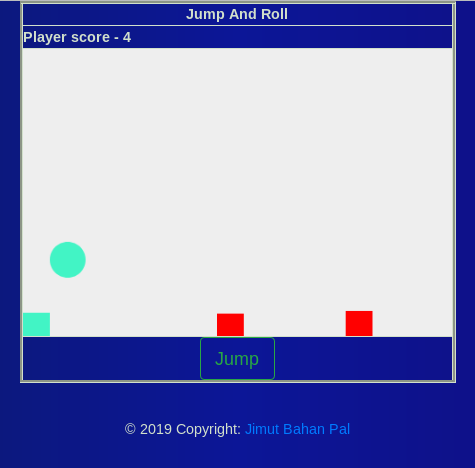

# JSGAMES

All the JS games that I'll build.

*   # Breakout2D

Thanks to [Andrzej Mazur](https://github.com/end3r) for creating such a great tutorial!
Also can be played live [here](https://cdn.staticaly.com/gh/Jimut123/JSGAMES/master/Breakout2D/mdn_breakout.html).

*   # Jump And Roll

#### For more games created by me [checkout](https://www.youtube.com/playlist?list=PLOmLd6CrOu1N5U3OkPl9esFHQmvoauR5h), which contains games build in unity 3D, 2D and [codeskulptor](https://github.com/Jimut123/code_skulptor_pygames).
